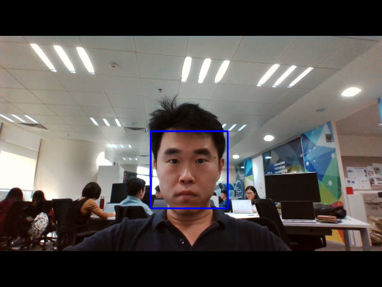

# AIoT-workshop

## Step 1: How to make your camera working and detect a face?

In this step, there are two functions provided to you in **MCU.py**
### initialize_facedetection()
This function is used for initiallize camera hardware and face detection algorithm, ***you do not have to do anything with this fucntion***
you need to aware that this fucntion return two varibles:
+ **faceDetectAlgorithm**: this is a algorithm that used to detect a human face 
+ **video_stream**: this is the video that camera captured
### facedetection_loop()
This function is used for trigger the camera shooting and pass the video into our algorithm. Do you remember the last function **initialize_facedetection()** provides you? **You need to fill in the algorithm and video captured varibles**, for example, your working zone looks like this: 
+  Your Beautyful work should be under!!!!!!!
    + faceAlgorithm = 'your face detection algorithm put here' 
    + face_video_stream = 'your face pictures should be here' 
+ Do not cross over me, thanks!!!!!!!!!!!!!! 
After you finish your work, you can run MCU.py by press Run button in IDE or python3 MCU.py in command line. You can see a windows pop up, and if you show your face in the camera, a blue squre will capture your face,

